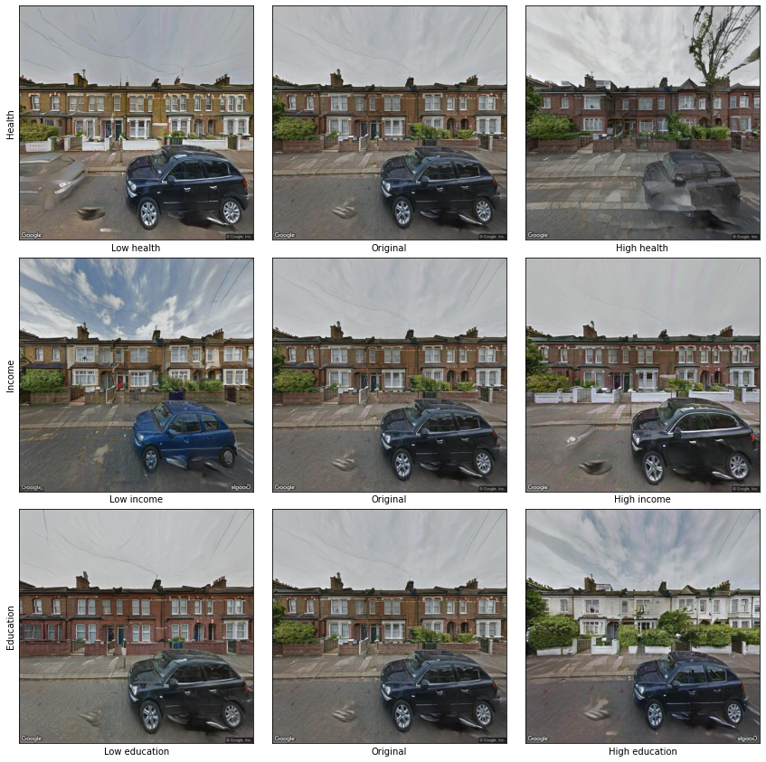
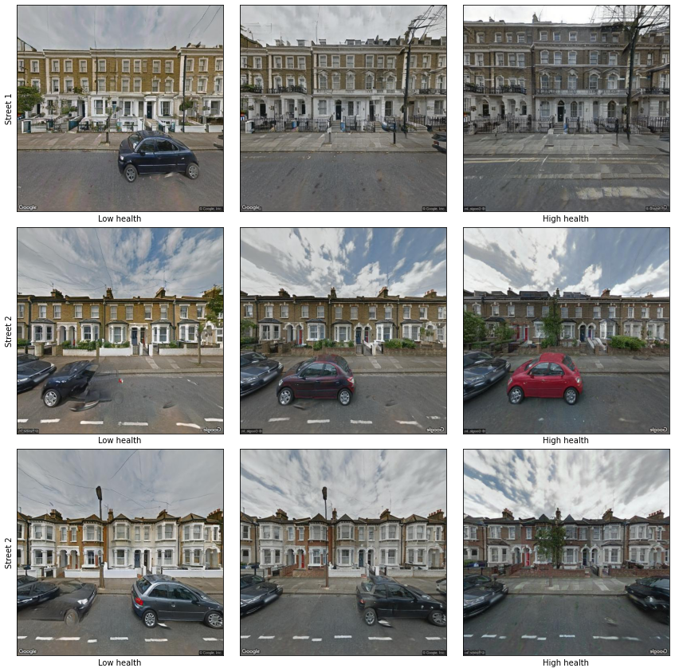
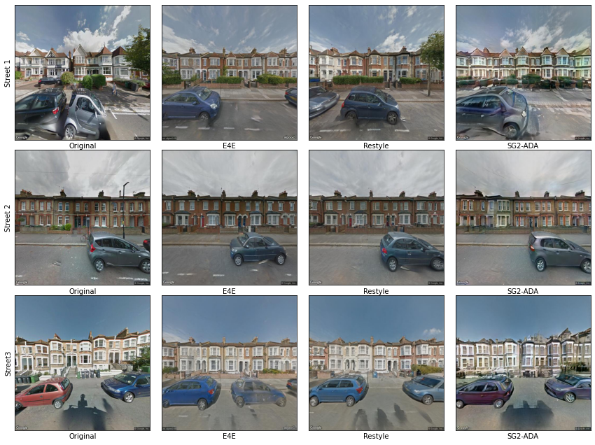

# Generative models for visualising abstract social processes: Guiding streetview image synthesis of StyleGAN2 with indices of deprivation

Aleksi Knuutila

## Abstract

The paper presents a novel approach to visualizing inequality in London using a generative adversarial model (GAN). The GAN is trained on a dataset of images from Google Streetview taken in London, and is able to generate new images that demonstrate the effects of inequality on the city. The paper also includes a web-based interface that allows users to manipulate the generated images based on income, health, and education levels. The authors argue that this interactive visualisation can help to make patterns of inequality more perceptible than simple statistical aggregates.

## Introduction

The image of London is perhaps above all as a global city and one of the more affluent parts of Europe. In reality, its distinctive feature might be that of a stark inequality, which by some measures is now as wide as it was during the Victorian era, and is still on an upward trend. The top 10% wealthiest in London have 273 times more wealth than the poorest 10%, according to the Hills Report (2010). This paper is about visualising this inequality and making it tangible, by utilising the novel capabilities of visual generative models. It is motivated by the common supposition that visual information, interactivity and animation can make patterns perceptible in a way that statistical aggregates cannot.

The paper is based on training a StyleGAN2-model, which is a popular architecture for Generative Adverserial Models (GANs). It is trained on a custom dataset of 14,564 images from Google Streetview taken in London. GANs are a state-of-the-art technique especially for high resolution image synthesis. They are based on identifying the lower-dimensional manifold in which images of training set are concentrated [@Lei2020]. It maps data points drawn from a Gaussian distribution from a so-called latent space onto the patterns observed in the images. 

Though In many application of GANs, they are not used just to generate new images, but to manipulate existing ones. This most typically means altering the facial features in photographs of people, or taking the style of one painting and applying it onto a photograph. In one experimental application, [@Schmidt2021] use GANs to manipulate images of cities to display the effect of flooding, thus visualising the effects of climate change in a concrete way. Typically in these applications the visual features that need to be changed in the images are known a priori, and GANs are used as the practical means to operationalise such changes. In this paper, we apply common techniques of image manipulation, but targeting abstract, social variables, for which the visual correlates are unknown. The visualisations produced by GANs are hence a way in which the effects of deprivation and inequality on the city can be explored.

The paper presents the results of the visualisation in still images. We have additionally produced a web-based interface, through which users can guide the image synthesis using by selecting input values in 3 dimensions (income, health and education) on a sliding scale. This interface highlights the potential for interactivity in visualisation, especially when using models such as GANs, which produce a continuous latent space that corresponds to meaningful generated images.

## Data

### Streetview dataset

The training set of Streetview images was downloaded from Google's API in July 2018. Images were searched within a radius of 15 kilometeres from Trafalgar Square (all within the administrative area of Greater London Authorities). Only images were selected that represent the view directly to the left of the direction the vehicle was facing, i.e. capturing the buildings on the same side of the street that the vehicle was on. The resulting dataset included 538,148 images.

Since Streetview images contain a considerable variety of visual content, a subset of images from the full dataset was selected, which could better be represented through a GAN. The selection criteria included the following:

- The image contains buildings (as opposed to, for instance, an open field).
- The image does not contain a street.
- Images of highrise-buildings were removed, since there was of a lower frequency and displayed a lot of variation.
- There are no large obstructions of the buildings in view, such as construction.
- The orientation of the photograph largely matched that of the pavement (as opposed to having been taken at an angle).

This smaller dataset was produced by first classifying 1,000 images by hand, and then training a simple visual classifier, based on logistic regression on VGG-16 features, to repeat the classification on the full dataset. The classification results were validated manually and images that did not fit the criteria were removed, until the size of the validated dataset was 14,564 images - a size for a dataset that in many domains is sufficient to make a Stylegan2-ADA model converge and produce good results.

### Indices of multiple deprivation

For every Streetview image, we also obtained numerical data about the social and economic quality in that area. The most geographically granular data of this type was from the Indices of Multiple Deprivation (IMD), which relative deprivate of areas across features such as income, education and environmental health of different areas. The data is based on British administrative data, and is aggregated by Lower Super Output Area (LSOA). The average population of an LSOA in London in 2010 was 1,722 [@LSOAAtlasLondonDatastore]. The IMD data used was from 2019. The indices represent a number of features, including income, employment, education and health. This are represented in ordinal rankings, describing the relative position of one area to another. 

## Methods

### Projection

GANs are primarily designed for image synthesis based on random sampling from the latent space. For our visualisation, we wanted to establish a correspondence between directions in the latent space and the features of the IMD dataset. For this purpose it's necessary to apply a process often referred to as projection, which finds vectors in the latent space that produce images that correspond as closely as possible with the input images. There are multiple different methods for performing projection: Some authors have proposed a tradeoff between visual consistency and editability of images. Different projection methods handle this trade-off in different ways. In this paper, we compare results from 3 different projection methods: ReStyle, Encoder4Editing and the optimisation-based projector that is part of the Stylegan2 repository.

### Interpolation in latent space

Once we have completed projection, every Streetview image is associated with both a latent code as well as additional data about deprivation in the area. The next step is to understand how the visual  features associated with a particular variable are encoded in the model's latent space. The method I applied for this was InterFaceGAN, which works by representing the non-visual data in binary form, and identifying a hyperplane inside of the latent space that works as a separation boundary between the data points from both classes. In our analysis, we used the Streetview images that were in the top and bottom 20% of each dimension to form the binary classes. InterFaceGAN also proposes a method for manipulation of images according to several variables simultaneously, by using vector projection to make identified semantic vectors orthogonal to each other. In this study, we focused on three dimensions: income, health and education, and found vectors for each that are independent of each other, i.e. that represent the visual features of those variables disentangled from the other variables.

## Results

### Finding semantic vectors

Semantic vectors were identified by fitting a support-vector machine to create a separation boundary. The data points included the top and bottom 20% ranks for IMD variables. Table 1 shows the accuracy of predictions made on a validation set (balanced, including 20% of training set). The results show that the features produced through projection have relatively high predictive power relative to the IMD data, i.e. they contain information that makes it possible to distinguish between deprived and privileged areas. The E4E and ReStyle models appear to produce embeddings that have more predictive power than those produced by the SG2-ADA method. The health dimension was most strongly connected with the Stylegan-models embeddings.

| Variable           | Projection model | Precision | Recall | F1 score |
|--------------------|------------------|-----------|--------|----------|
| Income_london_rank | E4E              |     0.794 |  0.721 |    0.756 |
| Education          | E4E              |     0.769 |  0.781 |    0.775 |
| Health             | E4E              |     0.899 |  0.754 |    0.820 |
| Income             | Restyle          |     0.788 |  0.772 |    0.780 |
| Education          | Restyle          |     0.773 |  0.763 |    0.768 |
| Health             | Restyle          |     0.836 |  0.788 |    0.811 |
| Income             | SG2-ADA          |     0.716 |  0.738 |    0.727 |
| Education          | SG2-ADA          |     0.735 |  0.700 |    0.717 |
| Health             | SG2-ADA          |     0.747 |  0.738 |    0.742 |
Table 1. XXX

### Visualising latent walks

In his *Visual explanations*, Edward Tufte discusses the different ways visualisations can facilitate comparisons, in what he calls visual parallelism [@Tufte1998, p. 80-83]. Parallelism involves a repetition and a contrast, the most basic form of which might be the "before/after" image, displaying two divergent views of the same subject. When images are located close to each other, they form a parallelism in space.

This is one option also to make comparison between synthetic images that have been produced the model. One option is to take a particular streetview, and see how it would change when displaying features associated with low or high health. These changes could be compared with analogical manipulations with regards to education and income. Image 1 shows a matrix organised in this manner. From it, we can see for instance that.. The basis image for this matrix is not an actual Streetview image, but is created random sampling from the model's latent space. 

Image 2 shows an alternative way to organise a matrix. Instead of having a single image to manipulate along several dimensions, it shows how several different images change according to a single dimension (in this case, health). The image manipulations performed by the GAN are specific to every single image, and it is interesting to see whether different dimensions will have different types of effects on, for instance, 2 floor semi-detached housing as they have on 3 floor terrace housing.

Tufte contrasts parallelism in space with parallelism in time. The latter refers to visualisations where they eyes can be fixed in one location while still producing a visual contrast, historically for instance through the application of flaps that change the image being viewed. A similar kind of parallelism in time is produced in the website, "thisinequalitydoesnotexist.com", which allows image manipulation with a slider along all three IMD dimensions. This gives people an interactive experience of moving through the latent space, in accordance with the 3 abstract social phenomena.

## Limitations and improvements

As a method of visualisation, image synthesis has obvious limitations: As is the case with many experimental methods, there isn't an obvious and established manner to validate the results, to distinguish between the biases and omissions of the model and representation of social phenomena.

## Conclusions

Above all, *This inequality doesn't exist* is an experiment of trying out how models such as GANs can be used to visualise and produce knowledge. The process makes tangible the visual correlates of some abstract qualities such as inequalities in income and education. 

## Appendix 1. Visual comparison of projection results from different models

## References